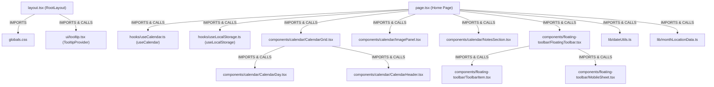

# Real-World Holdout Inspection: Frontend Wall Calendar Project

**REAL-WORLD HOLDOUT — NOT USED FOR PHASE 6.2 TUNING**

---

## 1. Experimental Rules & Purpose

> [!IMPORTANT]
> **This repository is an external, real-world holdout corpus.**
> 
> In accordance with strict experimental protocols:
> * This holdout dataset is **NOT** part of the Phase 6.2 parameter tuning dataset.
> * It must **NOT** be used to choose $\alpha$, tune fusion weights, modify ranking heuristics, or fabricate benchmark improvements.
> * The evaluation queries formulated in this document are **strictly frozen** prior to Phase 6.2 holdout evaluation.
> * Amoeba's implementation, parsers, and ranking formulas were **not modified** during or for this inspection.

---

## 2. Repository Overview

* **Repository Path**: `demo_test_projects/calendar`
* **Application Type**: Interactive Wall Calendar & Travel Destination Showcase Web Application
* **Framework Stack**: Next.js 15+ (App Router), React 19, TypeScript, Tailwind CSS v4, Lucide React, Framer Motion, date-fns
* **Dependency State**: `node_modules` intentionally absent (uninstalled, zero external dependencies required for Amoeba engine indexing)
* **Application Architecture**:
  * **App Shell & Routing**: Next.js App Router root layout ([`layout.tsx`](file:///d:/amoeba/demo_test_projects/calendar/src/app/layout.tsx)) and single-page dashboard ([`page.tsx`](file:///d:/amoeba/demo_test_projects/calendar/src/app/page.tsx))
  * **Calendar Matrix**: Core calendar views ([`CalendarGrid.tsx`](file:///d:/amoeba/demo_test_projects/calendar/src/components/calendar/CalendarGrid.tsx), [`CalendarDay.tsx`](file:///d:/amoeba/demo_test_projects/calendar/src/components/calendar/CalendarDay.tsx), [`CalendarHeader.tsx`](file:///d:/amoeba/demo_test_projects/calendar/src/components/calendar/CalendarHeader.tsx))
  * **Media & Information**: Destination photo showcase ([`ImagePanel.tsx`](file:///d:/amoeba/demo_test_projects/calendar/src/components/calendar/ImagePanel.tsx)) with 12 monthly Indian destination profiles
  * **Notes & Annotations**: Date-range persistent notes and highlights ([`NotesSection.tsx`](file:///d:/amoeba/demo_test_projects/calendar/src/components/calendar/NotesSection.tsx))
  * **Floating Controls**: Floating glassmorphic toolbar and mobile sheet ([`FloatingToolbar.tsx`](file:///d:/amoeba/demo_test_projects/calendar/src/components/floating-toolbar/FloatingToolbar.tsx))
  * **UI Kit**: Reusable Radix/Shadcn primitives (`button`, `card`, `dialog`, `sheet`, `tooltip`)
  * **Hooks & Lib**: Custom state management hooks ([`useCalendar.ts`](file:///d:/amoeba/demo_test_projects/calendar/src/hooks/useCalendar.ts), [`useLocalStorage.ts`](file:///d:/amoeba/demo_test_projects/calendar/src/hooks/useLocalStorage.ts)) and date utilities ([`dateUtils.ts`](file:///d:/amoeba/demo_test_projects/calendar/src/lib/dateUtils.ts))

---

## 3. File and Language Distribution

| Category | File Count | Details |
| :--- | :--- | :--- |
| **Total Files Discovered** | **70** | Full recursive file count in `demo_test_projects/calendar` (excluding absent `node_modules`) |
| **Source Files Included** | **27** | Files recognized and indexed by Amoeba's `RepositoryScanner` |
| **Non-Source Files Ignored** | **43** | Assets, configs, documentation, git metadata |

### Source Files Breakdown by Recognized Language

| Language | Count | File Paths |
| :--- | :---: | :--- |
| **TypeScript (React / TSX)** | 18 | `src/app/layout.tsx`, `src/app/page.tsx`, `src/components/calendar/CalendarDay.tsx`, `src/components/calendar/CalendarGrid.tsx`, `src/components/calendar/CalendarHeader.tsx`, `src/components/calendar/ImagePanel.tsx`, `src/components/calendar/NotesSection.tsx`, `src/components/floating-toolbar/FloatingToolbar.tsx`, `src/components/floating-toolbar/MobileSheet.tsx`, `src/components/floating-toolbar/ToolbarItem.tsx`, `src/components/layout/HeroImage.tsx`, `src/components/layout/QuoteSection.tsx`, `src/components/layout/ThemeProvider.tsx`, `src/components/ui/button.tsx`, `src/components/ui/card.tsx`, `src/components/ui/dialog.tsx`, `src/components/ui/sheet.tsx`, `src/components/ui/tooltip.tsx` |
| **TypeScript (.ts)** | 8 | `next-env.d.ts`, `next.config.ts`, `src/hooks/useCalendar.ts`, `src/hooks/useLocalStorage.ts`, `src/lib/dateUtils.ts`, `src/lib/monthLocationData.ts`, `src/lib/quotes.ts`, `src/lib/utils.ts` |
| **CSS (.css)** | 1 | `src/app/globals.css` |

### Ignored Files Distribution

* **Configuration**: `package.json`, `package-lock.json`, `tsconfig.json`, `components.json`, `eslint.config.mjs`, `postcss.config.mjs`, `.gitignore` (7 files)
* **Documentation**: `README.md`, `ARCHITECTURE.md`, `COMPONENT_API.md`, `SETUP_GUIDE.md` (4 files)
* **Assets & Images**: `src/assets/images/*.jpg` (12 monthly destination wallpapers), `public/*.svg` (5 vector icons)
* **Version Control**: `.git/` repository metadata

---

## 4. Parser Coverage & CodeElement Extraction

Amoeba's multi-language Tree-sitter parsing engine processed all 27 included source files without crashes or unhandled exceptions.

```text
files discovered:       70
files parsed:           27
files skipped:          0
syntax-error files:     2 (globals.css, layout.tsx — see Section 9)
CodeElements extracted: 2,820
```

### CodeElements Breakdown by Kind

| Element Kind | Extracted Count | Description / Role |
| :--- | :---: | :--- |
| **UtilityClass** | 1,280 | Tailwind CSS utility classes extracted from JSX `className` attributes |
| **Attribute** | 511 | JSX element props, event handlers, and HTML attributes |
| **Call** | 322 | Function, hook, and component invocation call sites |
| **JSXComponent** | 160 | Instantiations of custom React components in JSX |
| **JSXElement** | 142 | Native HTML/DOM elements instantiated in JSX (`div`, `button`, `span`, etc.) |
| **Property** | 118 | CSS declaration properties and TypeScript object properties |
| **Include** | 90 | ES module `import` declarations |
| **Hook** | 70 | React hook declarations and invocation sites (`useState`, `useEffect`, `useCalendar`, etc.) |
| **Function** | 45 | Named and arrow function definitions across components and utility libraries |
| **Component** | 45 | Functional React components and top-level page components |
| **Interface** | 18 | TypeScript interfaces, type aliases, and prop definitions |
| **Selector** | 17 | CSS class, pseudo-class, and root selectors in `globals.css` |
| **Route** | 2 | Next.js App Router entry routes (`layout.tsx`, `page.tsx`) |
| **Total Elements** | **2,820** | |

---

## 5. Relationship Graph Summary

Amoeba's Phase 5 cross-file relationship analysis integrated containment hierarchies, syntactic imports, and conservative call resolution:

```text
nodes:                  193
relationships:          236
contains:               84
imports:                42
includes:               0
inheritance:            0
implements:             0
calls:                  59
references:             51
unresolved imports:     48
unresolved calls:       313
```

### Key Component & Import Relationships



* **Intra-Project Imports**: 42 imports successfully resolved to concrete repository source files using path normalization and TypeScript `@/` alias mapping.
* **External Imports**: 48 imports from external packages (`react`, `next`, `date-fns`, `framer-motion`, `lucide-react`, `@radix-ui/*`) were correctly flagged as unresolved without synthesizing invalid graph nodes.
* **Calls & References**: 59 intra-file and cross-file calls (e.g. `Home` $\to$ `getMonthString`, `Home` $\to$ `getImagePanelData`, `handleToolbarAction` $\to$ `handlePreviousMonth`) were resolved with explainable reasons (`imported_symbol_match`, `enclosing_class_scope`).

---

## 6. Lexical Index Summary

Amoeba's lexical indexing pipeline indexed all extracted code elements and metadata:

```text
files:        27
elements:     2,820
unique terms: 2,255
postings:     50,471
avg length:   18.87 tokens/element
```

### Representative Searchable Terms from Repository
* **Component Names**: `CalendarGrid`, `CalendarDay`, `CalendarHeader`, `ImagePanel`, `NotesSection`, `FloatingToolbar`, `MobileSheet`, `ToolbarItem`, `ThemeProvider`, `RootLayout`
* **Custom Hooks**: `useCalendar`, `useLocalStorage`
* **Utility Functions**: `formatDate`, `getMonthString`, `getYearString`, `getMonthIndex`, `getImagePanelData`, `getQuoteForMonth`, `cn`, `buildRangeKey`, `getNoteColorClass`
* **Type Interfaces**: `MonthLocation`, `RangeNote`, `RangeHighlight`, `CalendarDayProps`, `DateRange`, `ToolbarAction`
* **Domain Vocabulary**: `destination`, `coordinates`, `festival`, `temperature`, `season`, `rangeKey`, `hoverDate`, `monthDays`, `activeTab`

---

## 7. Semantic Representation Samples

Below are 10 representative elements converted by Amoeba's `SemanticTextFormatter` (Representation A: Language, File, Kind, Context, Name, Detail):

### Sample 1: Root Layout Component
```text
Element: RootLayout (Component)
File:    src/app/layout.tsx
----------------------------------------
Language: TSX
File: demo_test_projects/calendar/src/app/layout.tsx
Kind: Component
Name: RootLayout
Detail: React Component
```

### Sample 2: Calendar Grid View Component
```text
Element: CalendarGrid (Component)
File:    src/components/calendar/CalendarGrid.tsx
----------------------------------------
Language: TSX
File: demo_test_projects/calendar/src/components/calendar/CalendarGrid.tsx
Kind: Component
Name: CalendarGrid
Detail: React Component
```

### Sample 3: Calendar Header Navigation Component
```text
Element: CalendarHeader (Component)
File:    src/components/calendar/CalendarHeader.tsx
----------------------------------------
Language: TSX
File: demo_test_projects/calendar/src/components/calendar/CalendarHeader.tsx
Kind: Component
Name: CalendarHeader
Detail: React Component
```

### Sample 4: Persistent Notes Section Component
```text
Element: NotesSection (Component)
File:    src/components/calendar/NotesSection.tsx
----------------------------------------
Language: TSX
File: demo_test_projects/calendar/src/components/calendar/NotesSection.tsx
Kind: Component
Name: NotesSection
Detail: React Component
```

### Sample 5: Floating Action Toolbar Component
```text
Element: FloatingToolbar (Component)
File:    src/components/floating-toolbar/FloatingToolbar.tsx
----------------------------------------
Language: TSX
File: demo_test_projects/calendar/src/components/floating-toolbar/FloatingToolbar.tsx
Kind: Component
Name: FloatingToolbar
Detail: React Component
```

### Sample 6: Calendar State Management Hook
```text
Element: useCalendar (Hook)
File:    src/hooks/useCalendar.ts
----------------------------------------
Language: TypeScript
File: demo_test_projects/calendar/src/hooks/useCalendar.ts
Kind: Hook
Name: useCalendar
Detail: React Hook
```

### Sample 7: LocalStorage Persistence Hook
```text
Element: useLocalStorage (Hook)
File:    src/hooks/useLocalStorage.ts
----------------------------------------
Language: TypeScript
File: demo_test_projects/calendar/src/hooks/useLocalStorage.ts
Kind: Hook
Name: useLocalStorage
Detail: React Hook
```

### Sample 8: Date Formatting Utility Function
```text
Element: formatDate (Function)
File:    src/lib/dateUtils.ts
----------------------------------------
Language: TypeScript
File: demo_test_projects/calendar/src/lib/dateUtils.ts
Kind: Function
Name: formatDate
```

### Sample 9: Classname Utility Function
```text
Element: cn (Function)
File:    src/lib/utils.ts
----------------------------------------
Language: TypeScript
File: demo_test_projects/calendar/src/lib/utils.ts
Kind: Function
Name: cn
```

### Sample 10: Location Metadata Interface
```text
Element: MonthLocation (Interface)
File:    src/lib/monthLocationData.ts
----------------------------------------
Language: TypeScript
File: demo_test_projects/calendar/src/lib/monthLocationData.ts
Kind: Interface
Name: MonthLocation
```

---

## 8. Frozen Candidate Holdout Queries (10 Queries)

> [!IMPORTANT]
> **FROZEN EVALUATION BENCHMARK**
> These 10 queries are proposed directly from the inspected holdout codebase. They have **NOT** been executed through Amoeba's hybrid retrieval engine and will remain untouched until formal Phase 6.2 holdout evaluation.

| # | Query String | Category | Target Symbol / Expected Relevant Element | Rationale |
| :-: | :--- | :--- | :--- | :--- |
| **Q1** | `CalendarGrid` | **Exact Identifier** | [`CalendarGrid`](file:///d:/amoeba/demo_test_projects/calendar/src/components/calendar/CalendarGrid.tsx) (`Component`) | Direct exact match for the 7-column monthly calendar matrix component. |
| **Q2** | `use calendar` | **Normalized Identifier** | [`useCalendar`](file:///d:/amoeba/demo_test_projects/calendar/src/hooks/useCalendar.ts) (`Hook`) | Space-separated normalized query targeting camelCase React date hook. |
| **Q3** | `LocalStorage` | **Partial/Subword** | [`useLocalStorage`](file:///d:/amoeba/demo_test_projects/calendar/src/hooks/useLocalStorage.ts) (`Hook`) | Subword search for client-side persistence handler for notes & highlights. |
| **Q4** | `FloatingToolbar action` | **Multi-Term** | [`FloatingToolbar`](file:///d:/amoeba/demo_test_projects/calendar/src/components/floating-toolbar/FloatingToolbar.tsx) (`Component`), `ToolbarAction` (`Interface`) | Multi-term query for floating navigation action bar and dispatch handlers. |
| **Q5** | `formatDate formatStr` | **Contextual Lexical** | [`formatDate`](file:///d:/amoeba/demo_test_projects/calendar/src/lib/dateUtils.ts) (`Function`) | Function identifier combined with its signature parameter term. |
| **Q6** | `RootLayout Next.js metadata` | **Framework** | [`RootLayout`](file:///d:/amoeba/demo_test_projects/calendar/src/app/layout.tsx) (`Component`, `Route`) | Next.js App Router root layout managing global OpenGraph SEO metadata. |
| **Q7** | `Dialog` | **Ambiguous** | [`Dialog`](file:///d:/amoeba/demo_test_projects/calendar/src/components/ui/dialog.tsx), `DialogContent`, `DialogHeader` (`JSXComponent`) | Ambiguous query spanning modal primitive definitions and page usage sites. |
| **Q8** | `Where is the location destination photo and travel description rendered for each month?` | **Conceptual / Semantic** | [`ImagePanel`](file:///d:/amoeba/demo_test_projects/calendar/src/components/calendar/ImagePanel.tsx) (`Component`), [`getImagePanelData`](file:///d:/amoeba/demo_test_projects/calendar/src/lib/monthLocationData.ts) (`Function`) | Natural language question targeting landscape photography showcase without quoting exact component names. |
| **Q9** | `MonthLocation getImagePanelData` | **Cross-File** | [`MonthLocation`](file:///d:/amoeba/demo_test_projects/calendar/src/lib/monthLocationData.ts) (`Interface`), [`ImagePanel`](file:///d:/amoeba/demo_test_projects/calendar/src/components/calendar/ImagePanel.tsx) (`Component`) | Cross-file data contract connecting destination datasets with UI presentation. |
| **Q10** | `CalendarDay rendered inside CalendarGrid` | **Component Relationship** | [`CalendarDay`](file:///d:/amoeba/demo_test_projects/calendar/src/components/calendar/CalendarDay.tsx) (`Component`), [`CalendarGrid`](file:///d:/amoeba/demo_test_projects/calendar/src/components/calendar/CalendarGrid.tsx) (`Component`) | Structural parent-child React relationship mapping date intervals to individual interactive day cells. |

---

## 9. Known Limitations Identified During Inspection

1. **Tailwind CSS v4 At-Rules in Tree-Sitter CSS**:
   * `src/app/globals.css` uses Tailwind v4 `@theme inline` and `@custom-variant dark (&:is(.dark *));`.
   * The baseline Tree-Sitter CSS parser flags syntax error nodes for unknown at-rules, but successfully recovers and extracts all 140 variables, selectors, and property declarations.
2. **External Library Call Boundary**:
   * Calls to external libraries (e.g. `date-fns` functions `startOfMonth`, `eachDayOfInterval`, React runtime `useState`, `useCallback`) are recognized as unresolved external calls. This is expected and desirable behavior preventing spurious node fabrication.
3. **TypeScript Path Aliases (`@/`)**:
   * Intra-project relative and alias imports were cleanly resolved (42 resolved imports), proving Amoeba's import extractor handles Next.js `@/` path aliasing soundly.

---

## 10. Summary Verification

```text
============================================================
REAL-WORLD HOLDOUT INSPECTION COMPLETE
Phase 6.2 not executed
No retrieval tuning performed
============================================================
```
